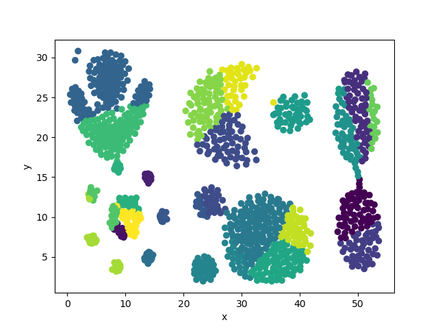
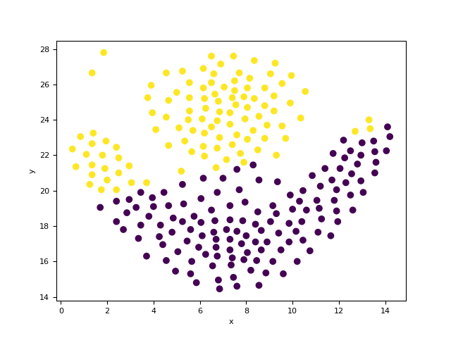
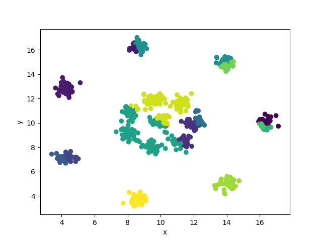
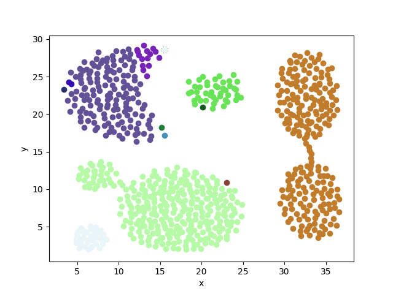
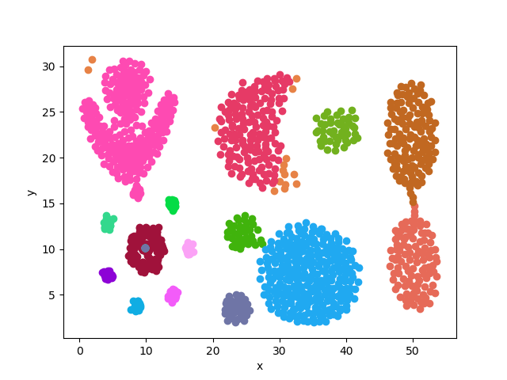
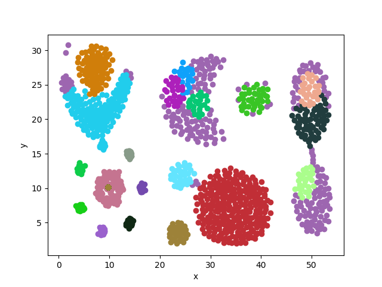
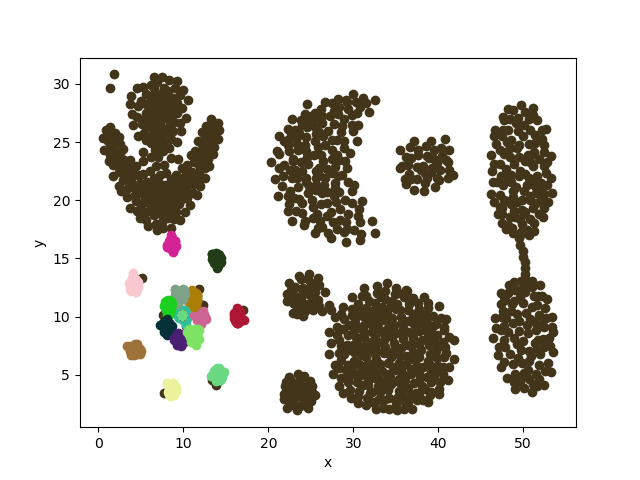

# 模式识别实验一 聚类

采用朴素 K-means 优化后的K-means和DBScan实现

* K-Means

**Aggregation**

**flame**

**R15**

**mix**

* K-Means 优化

**Aggregation**

**flame**

**R15**

**mix**

* DBScan

**Aggregation**

**flame**

**R15**

**mix**

Aggregation参数

flame参数

R15参数

