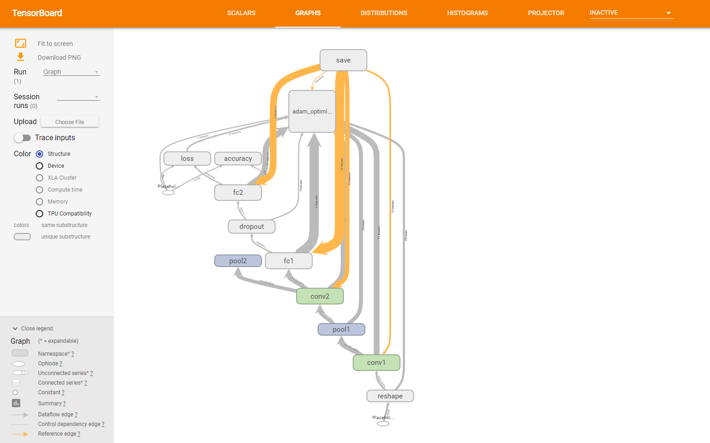
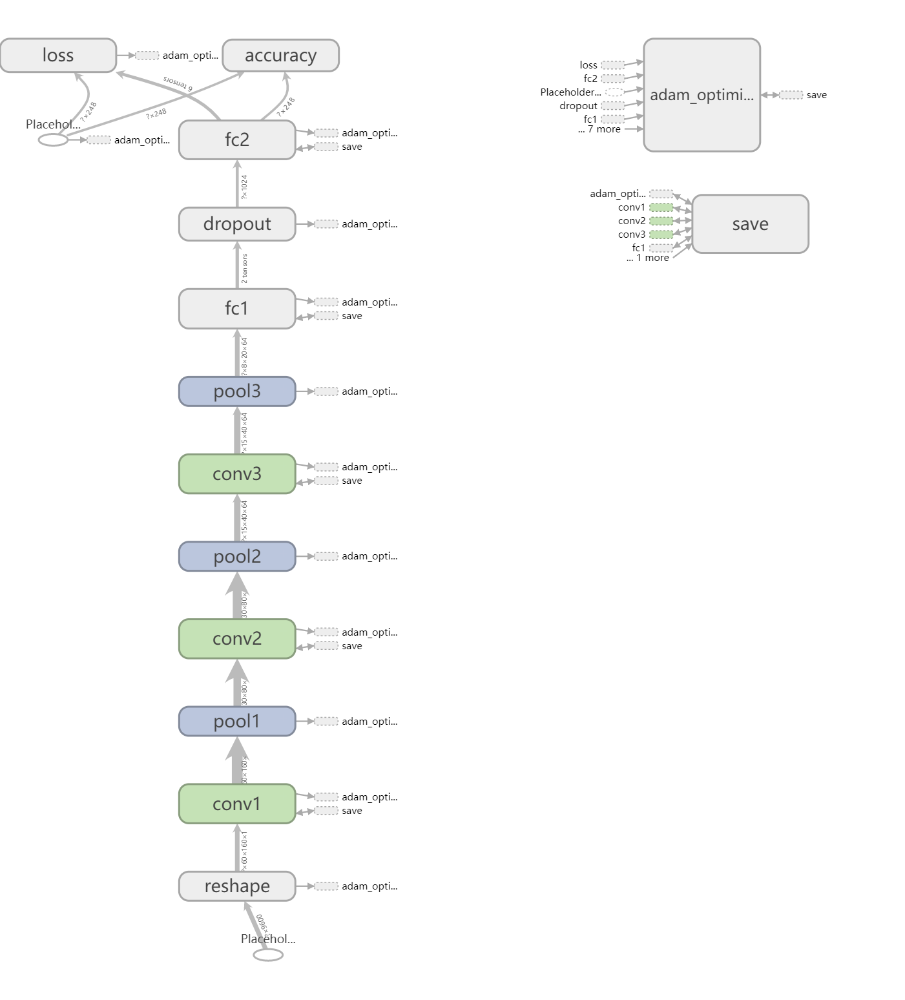
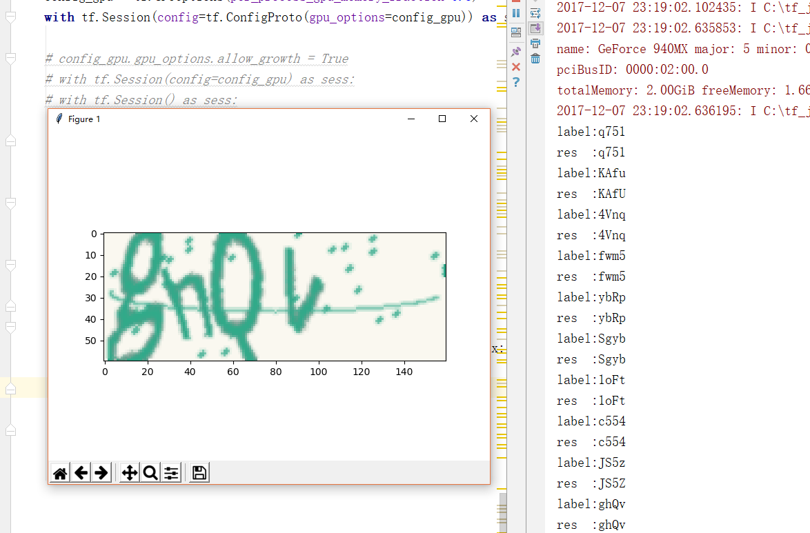

# CAPTCHA

数据集：每次训练随机生成50组验证码图片，包括数字和大小写字母。

训练次数：5万次

图像示例：
 

验证：随机生成50组数据验证准确率
CAPTCHA同样采用两种不同的CNN进行训练

* MNIST CNN 

由于验证码和MNIST均为字符数据，猜想可以采用同样的网络进行训练。

训练模型：

训练结果：准确率94.5%

* CNN

增加一层卷积层和池化层，并将窗口大小由5更改为3。

训练模型：

训练结果：准确率99%

* 验证可视化结果(Test.py)：

* 容易出错的数据

0-O o-O x-X c-C z-Z 等

* 代码说明

`attr.py` 训练相关参数

`generate.py` 验证码生成模块，提供了保存验证码功能

`TrainCaptcha-ori.py` MNIST模型及训练，提供模型保存与加载、TensorBoard可视化功能

`TrainCaptcha.py` 3层卷积的CNN模型及训练，提供模型保存与加载、TensorBoard可视化功能

`Test-ori.py` 展示MNIST模型正确性的验证程序

`Test.py` 展示3层卷积的CNN模型正确性的验证程序

