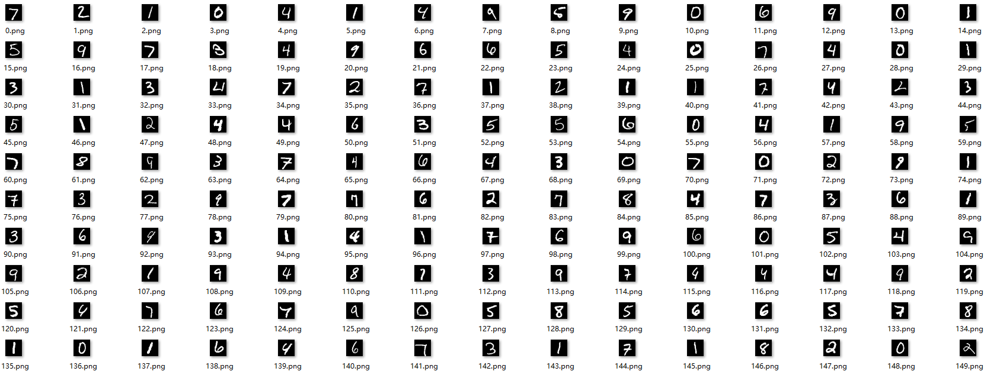
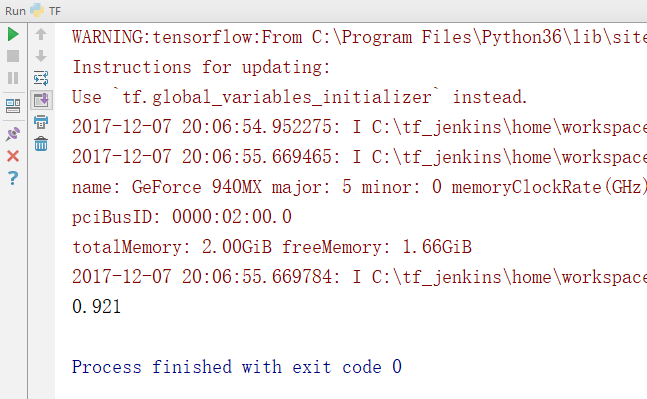
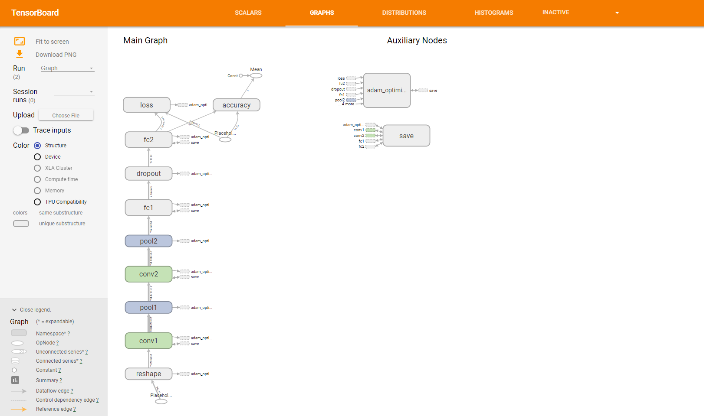
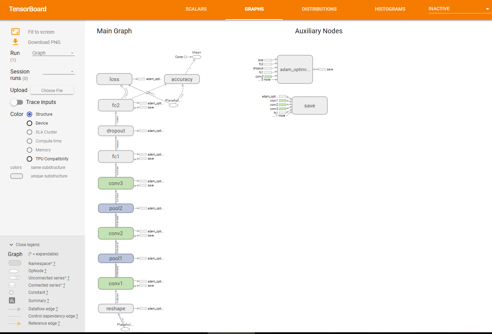

# MNIST

* 使用Python对ubyte文件进行解压并提取图像文件

* Softmax回归

准确率0.921

* CNN 
两种方式： 
&nbsp;&nbsp;&nbsp;&nbsp;2层卷积 2层池化 2层全连接 
&nbsp;&nbsp;&nbsp;&nbsp;3层卷积 3层池化 2层全连接 
在batch = 50，训练次数为2000次时，准确率均为0.9753

训练过程：`./TrainingLog/`

* TensorBoard可视化展示

使用 `tensorboard --logdir ./ `进行可视化展示，访问localhost:6006即可看到训练的过程。

CNN - 3层卷积

* 代码说明

`TF.py` Softmax回归

`MNIST.py` 两层卷积的CNN

`MNIST2.py` 三层卷积CNN