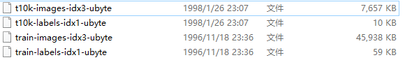

# MNIST Without deep learning


最高准确率（自己实现）  98.62%  （KNN with HOG Feature）

最高准确率（SKLearn）  98.67%  （SVM with HOG）


* KNN

文件： KNN-ori.py

运行结果：


|KNN|前2000训练集|全部数据|
|:-:|:-:|:-:|
|准确率|0.8895|0.9665|


* KNN with HOG Feature

文件：KNN-hog.py

运行结果：


|KNN-HOG|前200训练集|前2000训练集|全部数据|
|:-:|:-:|:-:|:-:|
|准确率|0.8135|0.9521|0.9862|


* KNN with PCA

文件：KNN-PCA.py

运行结果：

|KNN-PCA|前200训练集|前2000训练集|全部数据|
|:-:|:-:|:-:|:-:|
|准确率|0.7027|0.865|0.9287|
|用时|23s|224s|6120s|


***

# SKLearn

文件：SKLearn.py

* without HOG:
```
The accruacy of naive_bayes_classifier is :  0.8369
The accruacy of knn_classifier is :  0.9688
The accruacy of logistic_regression_classifier is :  0.9173
The accruacy of random_forest_classifier is :  0.943
The accruacy of decision_tree_classifier is :  0.877
The accruacy of gradient_boosting_classifier is :  0.9594
```
* adding HOG feature:

```
The accruacy of naive_bayes_classifier is :  0.9269
The accruacy of knn_classifier is :  0.9859
The accruacy of logistic_regression_classifier is :  0.9848
The accruacy of random_forest_classifier is :  0.9667
The accruacy of decision_tree_classifier is :  0.9075
The accruacy of gradient_boosting_classifier is :  0.9844

```

* SVM

文件：SVM.py


运行结果：

|SVM|前2000训练集|全部数据|
|:-:|:-:|:-:|
|linear|0.8384|-|
|poly|0.9282|0.9834|


with HOG:

运行结果：

|SVM with HOG|前2000训练集|全部数据|
|:-:|:-:|:-:|
|linear|0.9689|0.9867|
|poly|0.9186|0.9378|


* PCA

文件：SKLearn-PCA.py

```
The accruacy of knn_classifier is :  0.9276
The accruacy of logistic_regression_classifier is :  0.7891
The accruacy of random_forest_classifier is :  0.888
The accruacy of decision_tree_classifier is :  0.8247
The accruacy of gradient_boosting_classifier is :  0.901
```


# 其他文件

* `attr.py` 保存了程序运行定义的参数


|参数|值|
|:-:|:-:| 
|hogDim|324|
|K|10|
|Type|10|


* `hog.xml` 定义了提取HOG特征所需参数
* `readMnist.py` 提供了读取MNIST数据集的方法
项目下mnist文件夹存放如下文件：



* `requirement.txt` 需要安装的Python包
可以使用 `pip install -r requirement.txt` 进行安装


