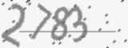
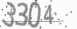
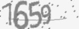
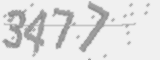
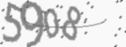
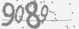
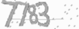
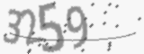
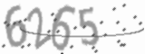

# Deep Learning Captcha Recognizer

## Mnist Recognizer

(mnist_recognizer.py)

Mnist recognizer, mainly based on TensorFlow's offical tutorial. Uses a 2 layer CNN with a 1024-node full connected readout layer to recognize.

With 20000 rounds of training (about 7 minutes to run), it reaches a accuracy of 99.71% on test set.

## Captcha Recognizer

(captcha_recognizer.py)

### Captcha Generation

I use a python library called captcha to generate captchas. I override some function in it's ImageCaptcha class to generate desired captcha (rotate, wrap and noise). It will generate captchas like this:

### Neural Network

A 3-layer DNN is used to recognize every single digits in the captcha.

Layer1 is a 7*7 convolution which extract 32 feature.

Layer2 is a 5*5 convolution which extract 64 feature.

Layer3 is a 5*5 convolution which extract 128 feature.

After that, a full-connected layer is used to readout the result.

The network uses tanh as activation function.

### Test

Single digit recognize accuracy is about 91.3% after 20000 rounds of training, with each training batch has 20 captchas.

On my machine (Xeon E5 2689 v4 *2, 32GB Mem, GTX 1080 8G, Windows Server 2016, TensorFlow-nightly-gpu 1.5.0, CUDA9.0), this takes about 30 minutes to train.

Here are some recognize result: 

Recognized as: 2783

### 

Recognized as: 3304

### 

Recognized as: 7659

### 

Recognized as: 8947

### 

Recognized as: 3477

### 

Recognized as: 5908

### 

Recognized as: 9089

### 

Recognized as: 7783

### 

Recognized as: 32**1**9

### 

Recognized as: 6265

