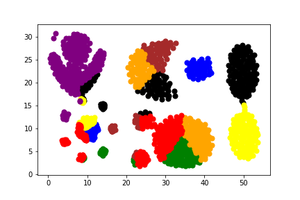
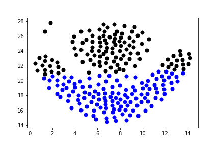
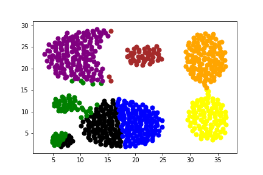

## Experiment1 Using FCM

### results

 1.R15.txt -finish all in 4.18s

2.mix.txt -finish all in 13.41s

3.flame.txt-finish all in 0.19s

4.Aggregation.txt-finish all in 1.77s

### Comparing with dbscan

Dbscan is better in clustering those irregular shapes while FCM is better in those regular shapes with non-uniform density distribution.

Besides, dbscan need to set both the eps and minPts while FCM need to know the clustering number first.

Also, FCM is much faster than dbscan.