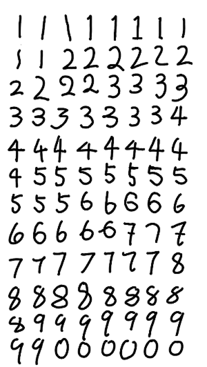

## 实验2.1 训练mnist数据集

Train on 60000 samples, validate on 10000 samples
Epoch 1/8
60000/60000 [==============================] - 163s 3ms/step - loss: 0.1972 - acc: 0.9409 - val_loss: 0.0499 - val_acc: 0.9839 0.5729
Epoch 2/8
60000/60000 [==============================] - 161s 3ms/step - loss: 0.0936 - acc: 0.9731 - val_loss: 0.0380 - val_acc: 0.9877
Epoch 3/8
60000/60000 [==============================] - 159s 3ms/step - loss: 0.0764 - acc: 0.9785 - val_loss: 0.0334 - val_acc: 0.9886
Epoch 4/8
60000/60000 [==============================] - 157s 3ms/step - loss: 0.0667 - acc: 0.9803 - val_loss: 0.0309 - val_acc: 0.9894
Epoch 5/8
60000/60000 [==============================] - 156s 3ms/step - loss: 0.0610 - acc: 0.9821 - val_loss: 0.0283 - val_acc: 0.9903
Epoch 6/8
60000/60000 [==============================] - 158s 3ms/step - loss: 0.0569 - acc: 0.9837 - val_loss: 0.0291 - val_acc: 0.9906
Epoch 7/8
60000/60000 [==============================] - 160s 3ms/step - loss: 0.0526 - acc: 0.9842 - val_loss: 0.0270 - val_acc: 0.9910
Epoch 8/8
60000/60000 [==============================] - 158s 3ms/step - loss: 0.0476 - acc: 0.9858 - val_loss: 0.0266 - val_acc: 0.9913
Final loss: 0.0265512766286
Final accuracy: 0.9913

## 实验2.2 识别手写数据

正确率：92%

错误的8个的概率分布：

    [[  2.83596762e-07   1.02065787e-04   1.92432344e-05   6.29730857e-05	5.13971597e-03   1.38451040e-04   4.43332993e-07   2.71674653e-04
    9.94049430e-01   2.15761509e-04]]
预测：8

真实图片: 

    [[  1.03781929e-07   9.90774970e-06   2.47117214e-07   1.37895149e-05	3.70915651e-01   2.90231801e-05   8.23651725e-09   3.50760783e-05
    2.31713220e-01   3.97282958e-01]]
预测：9

真实图片: 

    [[  3.25651263e-06   2.55512767e-08   3.27507962e-07   4.13775552e-07	5.93279843e-08   7.38162637e-01   2.14926794e-01   2.75360932e-11
    4.69051935e-02   1.33327217e-06]]
预测：5

真实图片: 

    [[  9.19637415e-08   9.46596672e-04   3.76537174e-01   4.65385020e-01	1.58055009e-05   7.37669416e-06   5.63216247e-07   1.44704282e-01
    1.23972865e-02   5.72103318e-06]]
预测：3

真实图片: 

    [[  3.55582044e-04   2.51456004e-05   8.86502206e-01   7.30480812e-03	4.03545200e-05   4.87751265e-07   3.84796941e-08   8.75210389e-02
    4.84286854e-03   1.34074381e-02]]
预测：2

真实图片: 

    [[  3.15658726e-05   1.03956550e-01   1.02940481e-02   1.09253250e-01	6.94217815e-05   1.24316644e-02   7.87181634e-05   1.16052151e-01
    5.35808861e-01   1.12023771e-01]]
预测：8

真实图片: 

    [[  6.91822333e-06   9.97576863e-02   1.85152038e-03   2.11003609e-02	3.00322827e-05   2.81279586e-04   1.77919856e-06   8.34044039e-01
    2.82498766e-02   1.46765355e-02]]
预测：7

真实图片:  

    [[  1.71072068e-04   3.98158655e-03   1.23422768e-03   3.64508689e-03	2.35310150e-03   1.61564257e-02   3.78726800e-05   2.72254944e-01
    3.71732563e-01   3.28433096e-01]]
预测：8

真实图片: 

测试图片：

