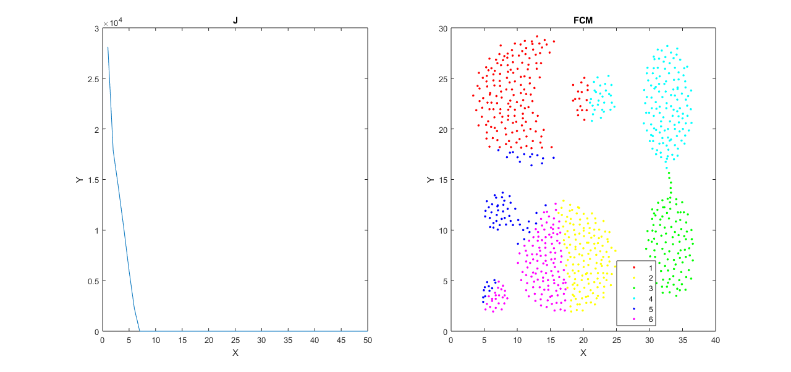
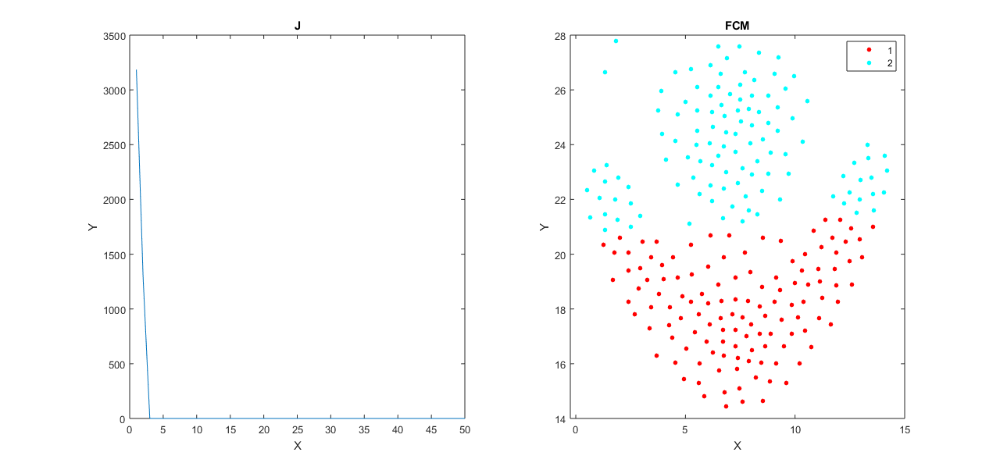
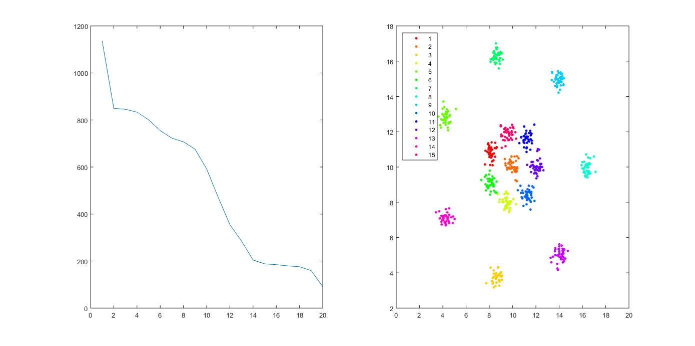
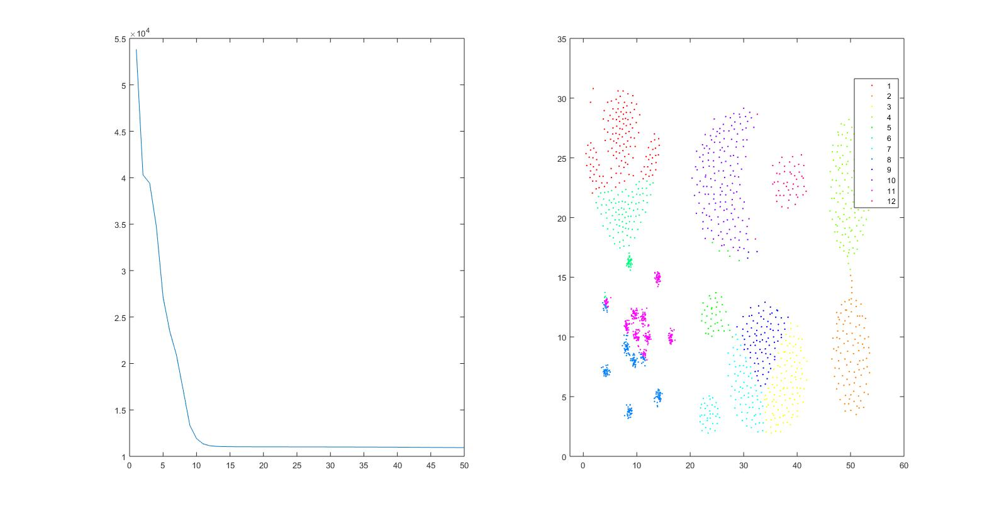
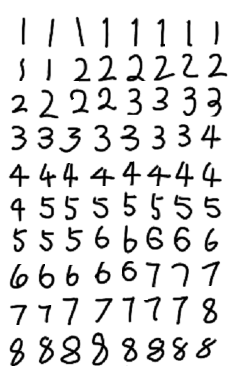
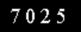
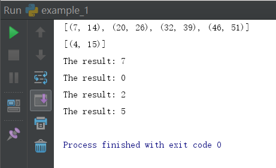

# 实验报告

### 实验一FCM方法运行结果

* Agg:




* flame




* R15



* mix

  

  ​

### 实验二

* 手写图片识别

``````
不同图片试验结果：
原准确率：55% ~ 65%
用滤波做模糊处理后：63% ~ 76%
``````

以如下图片为例：



```
用不同的滤波器结果：
	no_flter:T--44,F--36
	BLUR:T--50,F--30
	SMOOTH_MORE:T--52,F--28
	SMOOTH_MORE & BLUR:T--47,F--33
	MedianFilter(size=3):T--57,F--23
	ModeFilter(size=3):T--59,F--21
```

* 验证码识别

  原图片：

  

  处理后图片：

  

  运行结果：

  

  ​

  ```
  [(7, 14), (20, 26), (32, 39), (46, 51)]
  [(4, 15)]
  The result: 7
  The result: 0
  The result: 2
  The result: 5

  Process finished with exit code 0
  ```

  ​

  ​

  ​

  ​
